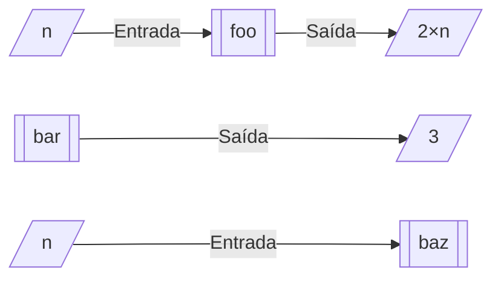

# Funções

## O que são funções?

Em C uma função é um bloco de código que pode ser executado sempre que
necessário. O ponto de entrada `main`, visto
[anteriormente](primeiro_programa.md#hello-world), é uma função. Um grande
motivo para utilizar funções é que basta utilizar seus nomes para executá-las.
Não é necessário reescrever o código, e isso facilita o desenvolvimento até de
pequenos programas.

## Entrada e saída

Uma função pode ter entrada (recebe dados) e/ou saída (retorna dados). Para
exemplificarmos as possibilidades, imaginemos algumas funções simples:

<div id="funcs"></div>

- **foo**, que recebe um número n e retorna seu dobro;
- **bar**, que não recebe nada e sempre retorna o número 3;
- **baz**, que recebe um número n e não retorna nenhum valor.



```admonish info "Efeitos colaterais"
Mesmo que uma função não produza saída, ela pode alterar o estado do programa,
causando efeitos colaterais. Por isso, até funções sem saída podem ser úteis.
```

## Definição

Para utilizar uma função em C, é necessário declará-la e defini-la—não faz
sentido utilizar uma função se o compilador não a conhece.

A definição de uma função utiliza a seguinte sintaxe:

<div class="syntax">

_saída_[^out] _nome_[^nome] **(**_params_[^in]**)** _corpo_[^corpo]

</div>

<!-- prettier-ignore -->
[^out]: Tipo de sua saída (dado que a função retorna).

<!-- prettier-ignore -->
[^nome]: Nome da função.

<!-- prettier-ignore -->
[^in]: Tipos e nomes de seus parâmetros (entradas—dados que a função recebe).

<!-- prettier-ignore -->
[^corpo]: Corpo (código) que deve ser executado pela função.

Agora definiremos as funções descritas [**acima**](#funcs).

- **foo**

  - **<_saída_>**: `int`  
    O tipo `int` representa um número inteiro.
  - **<_nome_>**: `foo`
  - **<_params_>**: `int n`  
    A entrada `n` deve ser um valor inteiro.
  - **<_corpo_>**: `{ return n * 2; }`  
    O corpo da função deve estar entre chaves. Apenas precisamos calcular o
    dobro de `n` (`n * 2`, pois `*` é o operador de multiplicação em C) e
    retorná-lo com a palavra-chave `return`. `return` também finaliza a execução
    da função.

  ```c
  int foo(int n) { return n * 2; }
  ```

- **bar**

  - **<_saída_>**: `int`
  - **<_nome_>**: `bar`
  - **<_params_>**: `void`  
    O tipo `void` representa a ausência de um valor.
  - **<_corpo_>**: `{ return 3; }`

  ```c
  int bar(void) { return 3; }
  ```

- **baz**

  - **<_saída_>**: `void`
  - **<_nome_>**: `baz`
  - **<_params_>**: `int n`
  - **<_corpo_>**: `{}`  
    Um corpo vazio, que não executa nada.

  ```c
  void baz(int n) {}
  ```

## Uso

Para utilizar as funções `foo`, `bar` e `baz` definidas acima, utilizamos a
sintaxe

<div class="syntax">

_expr_[^fn-syntax-expr] **(**_args_[^fn-syntax-args]**)**

</div>

<!-- prettier-ignore -->
[^fn-syntax-expr]: Expressão[^lang-expr] que denota uma função, e.g. o nome de
uma função.

<!-- prettier-ignore -->
[^fn-syntax-args]: Lista com zero ou mais argumentos (expressões) separados por
vírgula, e.g.  `5, pi + 3, 'z', 49`.

<!-- prettier-ignore -->
[^lang-expr]: Um trecho de código que calcula um valor, ou se refere a um
objeto/função, ou gera efeitos colaterais no programa, ou realiza qualquer
combinação desses comportamentos. Uma expressão que produz um valor pode ser
utilizada em alguns contextos em que se espera um valor, e.g. a expressão
`bar()` pode ser usada como um valor do tipo `int`.

Dizemos que uma função é "chamada" quando é utilizada dessa forma. Uma chamada
de função é uma expressão que possui o valor retornado pela função no final de
sua execução; isso significa que a expressão `bar()` (chamada da função `bar`) é
aproximadamente equivalente à expressão `3`. A função `bar2` abaixo, por
exemplo, retornará o valor `6` (`3 + 3`):

```c
int bar2(void) { return bar() + bar(); }
```

```admonish hint "Chamadas de função como argumentos"
Como chamadas de função são expressões, podemos utilizá-las como argumentos para
funções. `foo(bar())` resulta em `foo(3)`, que resulta em `6`.
```

## Funções na biblioteca padrão

Antes de criar uma função, verifique se uma equivalente já não existe na
biblioteca padrão do C. Para calcular o logaritmo natural de um número, por
exemplo, basta utilizar a função `log` do arquivo `<math.h>`. Um programa que
calcula o logaritmo natural de 5 pode ser feito assim:

```c
#include <math.h>

int main(void)
{
    log(5);

    return 0;
}
```

Embora `<math.h>` seja parte da biblioteca padrão, seu código pode não ser
ligado automaticamente ao programa. Para solicitar a ligação no compilador GCC,
adicione o argumento `-lm` na compilação (e.g. `gcc main.c -lm`). Em outros
compiladores o procedimento pode ser diferente.

Lembre-se também que no código acima, o valor de `log(5)` não é utilizado ou
exibido—a exibição de valores numéricos será introduzida posteriormente.
