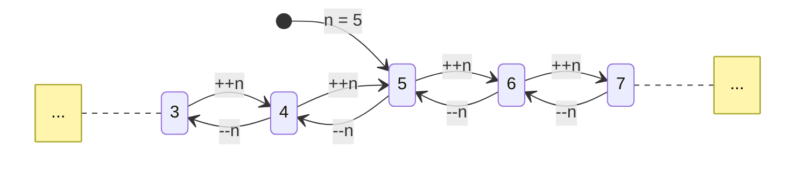

# Operadores de incremento e decremento

Incrementar ou decrementar algum número por 1 é muito comum, portanto existem
operadores para fazer isso de forma concisa.

## Operadores de prefixo `++` e `--`

Estes operadores unários ficam à esquerda de seus operandos e os modificam,
incrementando (`++`) ou decrementando (`--`) o valor em 1.

Aqui está um diagrama ilustrando as alterações que estes operadores causam no
valor de uma variável:



```c
int n = 5;
++n; // n agora vale 6
--n; // n agora vale 5
--n; // n agora vale 4
++n; // n agora vale 5
```

Estas operações não só modificam o operando como também produzem seu novo valor.
Isso significa que a expressão `++n` produz o valor `n + 1` e a expressão `--n`
produz `n - 1`.

```c
int n = 5;

printf("%d\n", ++n);
printf("%d\n", --n);
```

> 6  
> 5

## Operadores de sufixo `++` e `--`

Ao contrário dos operadores de prefixo, estes operadores ficam à direita do
operando. O comportamento é similar: `++` incrementa e `--` decrementa, porém a
expressão produz o valor original e o incremento/decremento não ocorre
imediatamente mas sim durante ou antes do próximo ponto de sequência. Pontos de
sequência existem em vários lugares diferentes, e.g. todo `;` é um ponto de
sequência.

```c
int n = 5;

printf("%d\n", n++); // n++ produz 5 e depois incrementa n
printf("%d\n", n);
```

> 5  
> 6

```admonish danger "Operações não sequenciadas"
Quando, sem um ponto de sequência entre as expressões, o valor de um objeto for
incrementado/decrementado várias vezes, ou incrementado/decrementado **e**
acessado, o comportamento do programa é indefinido.

~~~c
int n = 0;
printf("%d %d", n, ++n); // Comportamento imprevisível: n incrementado e
                         // acessado sem um ponto de sequência entre as
                         // expressões
~~~

O programa acima pode exibir qualquer saída ou até travar, pois o valor de `n`
pode ser acessado antes/**durante**/após seu incremento. Isso será detalhado
posteriormente.
```
