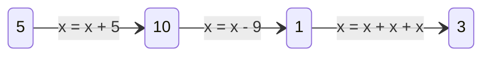

# Variáveis

## Declaração e inicialização

A maneira mais simples de armazenar e acessar dados em C é pelo uso de objetos,
que são regiões na memória que podem representar valores de diversos tipos. Uma
forma simples de criar um objeto consiste em nomeá-lo e especificar seu tipo,
com a seguinte sintaxe:

<div class="syntax">

_tipo_ _nome_

</div>

Assim, após a declaração `int x;`, `x` irá se referir a um objeto do tipo `int`.

Como a variável `x` foi definida sem algum valor especificado, na maioria dos
casos ela é uma variável não inicializada, ou seja, armazena um valor "lixo" que
já estava na memória. Para inicializá-la, basta especificar um inicializador
(valor inicial), utilizando a sintaxe:

<div class="syntax">

_tipo_ _nome_ **=** _expr_[^expr]

</div>

[^expr]: Expressão que produz um valor.

Substituindo `int x;` por `int x = 5;`, `x` passa a possuir o valor inicial
especificado.

## Uso

O valor de uma variável pode ser acessado e modificado durante a execução do
programa. Aqui está um código e um diagrama que representa as alterações no
valor `x` durante sua execução:

```c
int main(void)
{
    int x = 5;

    x = x + 5;
    x = x - 9;
    x = x + x + x;

    return 0;
```



O identificador de uma variável é uma expressão que produz o valor armazenado em
seu respectivo objeto, portanto após a expressão `x = 10`, a expressão `x`
produz o valor `10`; nesse caso `x + 3` é o mesmo que `10 + 3`.

## Escopo

Todos os identificadores, como nomes de variáveis e funções, possuem um escopo
que determina onde podem ser acessados.

### Escopo de Bloco

Os parâmetros de uma função podem ser acessados apenas em seu corpo, isso
significa que `n` pode ser acessado em `foo` mas não em `bar`:

```c
int foo(int n)
{
    return n; // Okay
}

int bar(void)
{
    return n; // Erro: n não existe nesse contexto
}
```

Isso se chama escopo de bloco, ou seja, o identificador é acessível dentro do
bloco (`{}`) envolvente. No caso da seguinte variável `n`, seu escopo inicia em
sua declaração e termina no final do bloco.

```c
int foo(void)
{
    int n;

    return n; // Okay
}

int bar(void)
{
    return n; // Erro: n não existe nesse contexto
}
```

Um identificador também não pode ser definido duas vezes no mesmo bloco, mas
blocos podem ser aninhados:

```c
int foo(void)
{
    int n;

    int n; // Erro: n já foi definido nesse bloco
}

int bar(void)
{
    int n;

    {
        int n; // Okay: Este n está contido apenas nesse bloco
    }
}
```

Vale lembrar que mesmo sendo o mesmo identificador, `n` representa uma entidade
diferente em cada escopo em que é declarado:

```c
int foo(void)
{
    int n = 5;

    {
        int n = 10;

        return n; // Isso retorna 10 e não 5, pois a redeclaração de n torna o n
                  // anterior inacessível
    }

    return n; // Isso retorna 5 pois o escopo do segundo n termina e o primeiro
              // volta a estar acessível
}
```

Caso um identificador não seja redeclarado em um bloco aninhado, sua declaração
original será acessada:

```c
int foo(void)
{
    int n = 5;

    {
        return n; // Isso retorna 5
    }
}
```

### Escopo de Arquivo

Uma variável declarada fora de um bloco possui escopo de arquivo—pode ser
acessada em qualquer lugar do arquivo após sua declaração:

```c
int n = 5;

int foo(void)
{
    return n; // Retorna 5
}

int bar(void)
{
    return n; // Retorna 5
}
```

Diferente de variáveis com escopo de bloco, variáveis com escopo de arquivo são
inicializadas com valores definidos de acordo com seus tipos. Se o inicializador
fosse removido do código acima `n` armazenaria `0`, enquanto se `n` tivesse
escopo de bloco não haveria nenhuma garantia de seu valor.

```admonish info "Comentários"
A sequência `//`, desde o padrão C99, transforma o resto de uma linha em um
comentário—trecho que será ignorado.

Trechos iniciados em `/*` e terminados em `*/` são comentários que podem
abranger múltiplas linhas.
```
